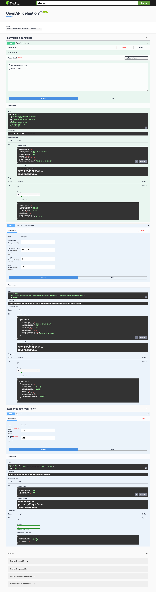
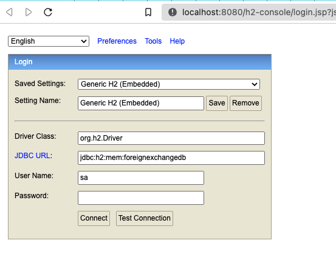
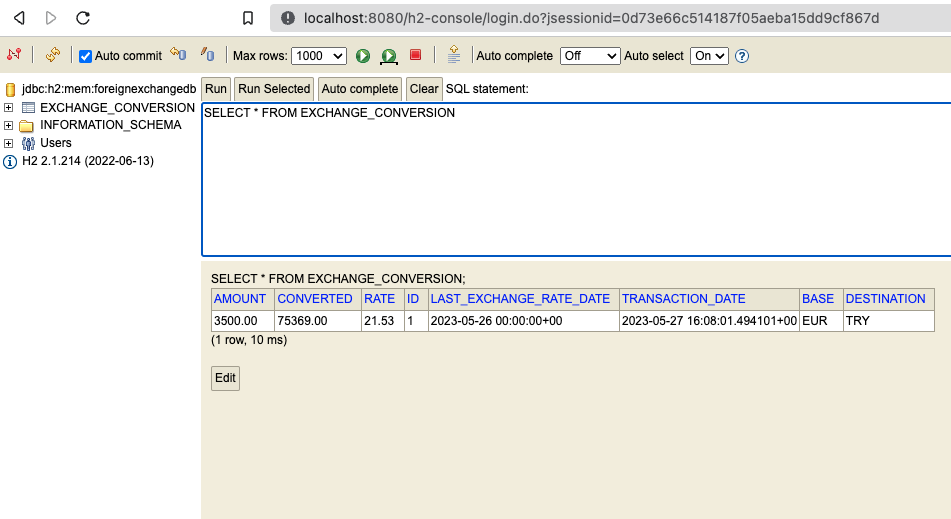
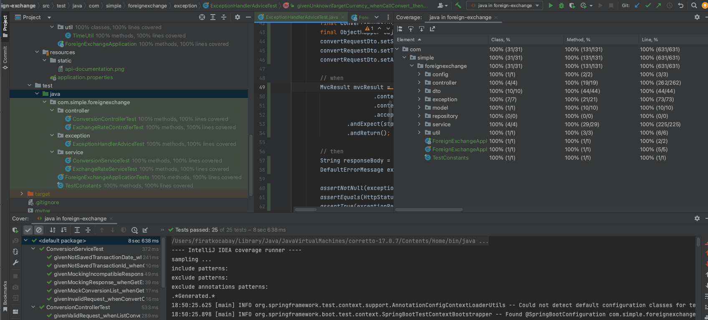

# Project Definition

A Simple Foreign Exchange  [Spring Boot](http://projects.spring.io/spring-boot/) application.

## Requirements

For building and running the application you need:

- [Java 17](https://www.oracle.com/java/technologies/downloads/#java17)
- [Maven 3](https://maven.apache.org)

## Running the application locally

There are several ways to run a Spring Boot application on your local machine. One way is to execute the `main` method in the `com.simple.foreignexchange.ForeignExchangeApplicationn` class from your IDE.

Alternatively you can use the [Spring Boot Maven plugin](https://docs.spring.io/spring-boot/docs/current/reference/html/build-tool-plugins-maven-plugin.html) like so:

```shell
mvn spring-boot:run
```

## Test Rest API Using Swagger UI

The easiest way to test all Rest API on this sample application:
* Firstly, run application  ```mvn spring-boot:run```
* Secondly, open [Application Swagger UI](http://localhost:8080/swagger-ui/index.html) on your browser and start to test APIs.





## Control Records on DB Console

If you want to access the app db, you can open your browser [Application DB H2 Console](http://localhost:8080/h2-console)

You might need to change ```JDBC_URL``` to ```jdbc:h2:mem:foreignexchangedb``` which we define in ```application.properties``` file earlier. 

Then, once you connect to the database, you should be able to query the ```exchange_conversion``` table.





## Unit Test Coverage Result


